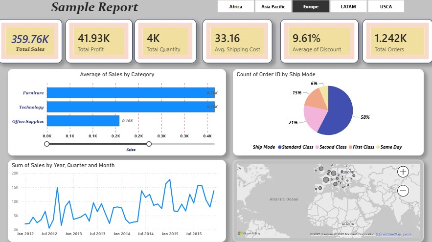

# 📊 PowerBI Sales Dashboard

## Project Overview
This project is an interactive Sales Dashboard developed using Microsoft Power BI to analyze sales performance and generate business insights.

## Objective
The objective of this dashboard is to transform raw sales data into meaningful visualizations that help in tracking sales performance, profit, quantity, shipping cost, discounts, and order trends.

## Tools Used
- Microsoft Power BI
- Microsoft Excel

## Dashboard Features
- KPI Cards (Total Sales, Total Profit, Total Quantity, Average Shipping Cost, Average Discount, Total Orders)
- Sales by Category Analysis
- Ship Mode Analysis
- Monthly Sales Trend
- Geographic Sales Distribution using Map
- Interactive Region Filter

## Dashboard Preview

## Files Included
- First PBI.pbix
- Dashboard.jpeg

## Skills Demonstrated
- Data Cleaning
- Data Visualization
- Dashboard Design
- KPI Reporting
- Business Intelligence (BI)
